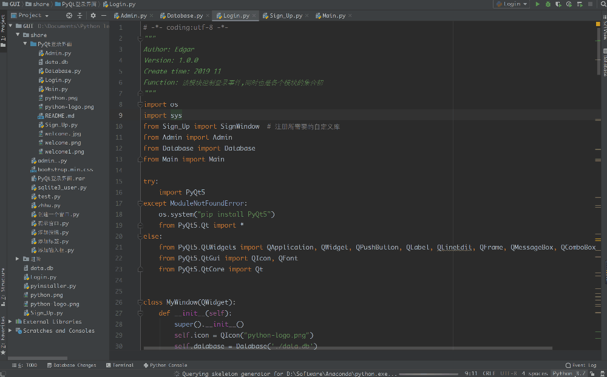
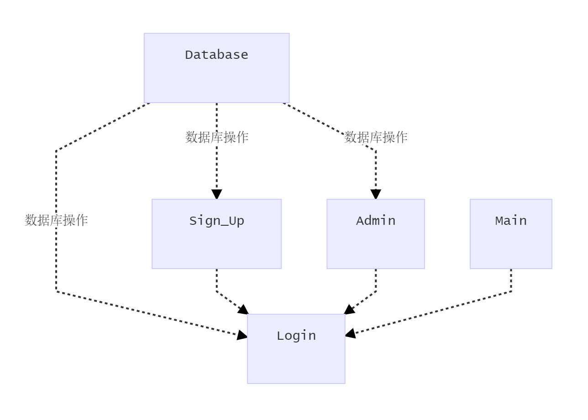

## 用户登录和注册界面

##### 一. 声明

1. 本人去年系上海交通大学`材料科学与工程学院`的一名2018级学生，于2019年通过转专业有幸进入`信息安全专业`学习              
2. 该用户界面为本人独立开发
3. 该界面设计为本人为`上海交通大学程序设计思想与方法`,教学班`(2019-2020-1)-CS902-3`所制作的课程大作业
4. 之所以选择制作该`GUI用户界面`的原因是学习`tkinter`之后发现其用作界面设计有许多不足之处，并于前段时间学习过部分`PyQt`知识，便用此为实践
5. 该界面非使用`Qt Designer` 生成，为本人使用`PyCharm 2019.2.25`写就
6. 本人于2019秋季学期开始学习python，大学之前`未接触编程`

##### 二. 使用说明

1. 界面逻辑

2. 该GUI界面的主要用于应用程序的登录和注册，并用数据库`sqlite3`保存用户的信息，但只是保存在本地

3. 该GUI界面使用十分简单，与平常的网页版注册登录没有太多区别，另外有管理员的管理界面，可用于对所有用户的相关操作

4. 本GUI界面应该在**Python3**环境下运行，python2似乎`不支持`PyQt，本人在`PyCharm 2019.2.5 + Anaconda3 `环境下可以成功运行

5. 下面为部分功能演示gif，图片并不是很清晰，可自行运行测试效果

##### 三. 模块说明

1. Login.py

    该模块主要负责用户的登录，以及与其他窗口的联系，使用时应该注意安装`PyQt5`模块，如果没有安装则会调用`os`模块使用`pip`进行安装，若安装失败，则无法进行下一步，但是还是建议自己先配置好pyqt5的环境

    

2. Sign_Up.py

    该模块主要负责用户的注册，注册时候必须两次输入的密码相同并且用户名不存在方可成功注册，否则提示用户名已经存在，并要求重新填写，注册完成之后，窗口关闭，返回之前的登录窗口
    
    
    
3. Admin.py

    该模块负责管理员对所有用户的操作，包括删除，修改密码，添加用户等,

    删除用户的时候，需要选择前面的选择框，然后点击`Delete`， `Select All`可方便一次性选择全部，点击之后变为`Unselect`,可用于不选择任何用户，`Clear`可一次性删除全部，包括`admin`，但是之后仍会自动生成`admin`并设置好默认密码，`Refresh`可以更新表格，将数据库中的数据重新添加到表格中，`Update`必须对应已有的用户名，否则报错提示，`Add`可以实现添加用户，但必须是数据库中没有的用户，`Show`可以用于添加用户时的密码框文本是否显式显示出来，点击之后变为`Hide`

    

4. Database.py 

    为操作数据库提供接口，可实现插入数据，获取数据，以用户名查找密码，以用户名更新密码，以用户名删除数据，清空数据库等功能

    

5. Main.py 

    该模块为用户登录后所看到的界面，可由自己自定义设置，在这里并没有过多的设置，只是展现一个图像，表示登录完成

    
##### 四、不足之处
- 由于时间问题，主界面并没有进行相关的设置，显得比较简陋
- 部分代码显得有点冗余，可以进行更细致的模块化，减少代码量
- 囿于能力问题，总体界面非动态，并且设置了不可改变的大小
- ......

